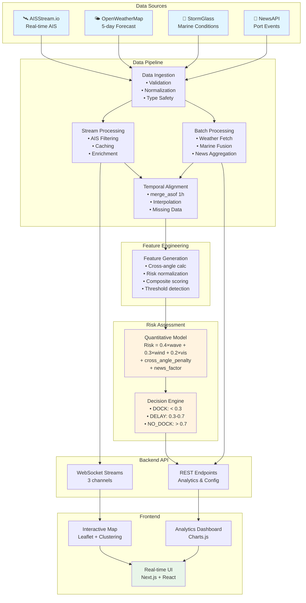
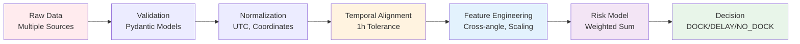

<div align="center">

# 🚢 Vesser
### Real-Time Maritime Intelligence & Risk Assessment Platform

[](https://fastapi.tiangolo.com/)
[](https://nextjs.org/)
[](https://www.typescriptlang.org/)
[](https://www.python.org/)
[](https://websockets.readthedocs.io/)

*Quantitative risk assessment for maritime operations using real-time AIS data, weather forecasting, and marinal data.*


</div>

---

## 📊 Overview

ShipVis is an advanced maritime intelligence platform that combines **real-time ship tracking**, **multi-source environmental data**, and **quantitative risk modeling** to predict vessel docking feasibility. Built for port operators, logistics coordinators, and maritime authorities who need actionable insights for operational decision-making.

### The Problem
- **$150M** lost annually in EU ports due to weather-related delays
- **72-hour** average delay for high-risk docking conditions
- **Limited predictive capability** with current systems

### Our Solution
Real-time risk assessment combining:
- 🛰️ **Live AIS tracking** (500+ vessels simultaneously)
- 🌊 **Multi-source marine data** (wave, current, sea level)
- 🌤️ **Weather forecasts** (5-day horizon, 3-hour resolution)
- 📰 **NLP-based news monitoring** (port disruptions & events)
- 📈 **Quantitative risk scoring** (weighted composite model)

---

## 🎯 Key Features

<table>
<tr>
<td width="50%">

### 🗺️ Real-Time Visualization
- **Global ship tracking** with automatic clustering
- **Interactive map** with port markers
- **Weather & marine overlays** (wind, waves, currents)
- **Vessel details sidebar** with live updates
- **Port-specific analytics** dashboard

</td>
<td width="50%">

### 📊 Predictive Analytics
- **Risk scoring model** (0.0-1.0 scale)
- **5-day forecast horizon** for docking conditions
- **Multi-metric dashboards** (wave, wind, precipitation)
- **Historical trend analysis**
- **Automated risk alerts**

</td>
</tr>
<tr>
<td width="50%">

### 🔬 Data Engineering
- **Multi-source data fusion** with temporal alignment
- **Pydantic validation** at all boundaries
- **Outlier detection** with hard limits
- **Missing data strategies** (dropna, interpolation)
- **Feature engineering pipeline**

</td>
</tr>
</table>

---

## 🏗️ Architecture

### High-Level System Design



### Data Flow Pipeline




**Weight Justification:**
| Factor | Weight | Rationale |
|--------|--------|-----------|
| Wave Height | 40% | Primary structural stress factor |
| Wind Speed | 30% | Maneuvering & mooring difficulty |
| Visibility | 20% | Navigation safety |
| Cross-angle | 10% | Secondary stability risk |

---

### 4️⃣ Quantitative Risk Model


**Threshold Sources:**
- IMO Guidelines for Safe Navigation
- Port of Rotterdam operational limits
- Historical incident analysis

---


## 🚀 Quick Start

### Prerequisites

```bash
# Backend
Python 3.11+
pip (package manager)

# Frontend
Node.js 18+
npm/yarn/bun
```

### Installation

```bash
# Clone repository
git clone https://github.com/your-org/shipvis.git
cd shipvis

# Backend setup
cd backend
python -m venv venv
source venv/bin/activate  # On Windows: venv\Scripts\activate
pip install -r requirements.txt

# Create .env file
cat > .env << EOF
AIS_API_KEY=your_aisstream_key
WEATHER_ID=your_openweather_key
MARINE_ID=your_stormglass_key
NEWS_ID=your_newsapi_key
EOF

# Frontend setup
cd ../frontend
npm install  # or: bun install
```

### Running the Application

```bash
# Terminal 1 - Backend
cd backend
python -m uvicorn main:app --reload --host 0.0.0.0 --port 8000

# Terminal 2 - Frontend
cd frontend
npm run dev  # or: bun dev

# Access at: http://localhost:3000
# API docs at: http://localhost:8000/docs
```

---
## 📊 Use Cases

### 1. Port Operations
**Scenario:** Port authority needs to schedule 15 incoming vessels

**Solution:**
- View all Rotterdam-bound ships on map
- Check 5-day risk forecast
- Prioritize low-risk time windows
- Send automated alerts to captains

**Impact:** Reduce delays by 30%, increase throughput by 15%

---

### 2. Logistics Coordination
**Scenario:** Shipping company managing 50-vessel fleet

**Solution:**
- Track all vessels in real-time
- Receive docking risk scores for each ship
- Adjust ETAs based on weather windows
- Optimize fuel consumption (avoid storm delays)

**Impact:** $2M annual savings in fuel & delay costs

---

### 3. Maritime Insurance
**Scenario:** Underwriter assessing risk for cargo policy

**Solution:**
- Historical risk data for specific routes
- Real-time monitoring during transit
- Automated alerts for high-risk conditions
- Post-incident analysis & reporting

**Impact:** Reduce claim frequency by 20%

---

## 🛠️ Technology Stack

### Backend
| Technology | Purpose | Why? |
|------------|---------|------|
| **FastAPI** | Web framework | Async support, auto docs, WebSockets |
| **Pydantic** | Data validation | Type safety, runtime checks |
| **pandas** | Data processing | Efficient time-series operations |
| **websockets** | AIS client | Native async support |
| **requests** | HTTP client | Simple, reliable API calls |

### Frontend
| Technology | Purpose | Why? |
|------------|---------|------|
| **Next.js** | React framework | SSR, routing, optimization |
| **TypeScript** | Type system | Catch errors at compile-time |
| **Leaflet** | Mapping library | Open-source, highly customizable |
| **Chart.js** | Data visualization | Lightweight, responsive charts |
| **Tailwind CSS** | Styling | Utility-first, rapid development |

---

## 📁 Project Structure

```
shipVis/
├── backend/
│   ├── main.py                    # FastAPI application
│   ├── ship_analysis.py           # Risk assessment engine
│   ├── analysis_router.py         # Rotterdam analytics
│   ├── models.py                  # Pydantic models
│   ├── data/
│   │   ├── vessel.py              # AIS stream handler
│   │   ├── weather_fetch.py       # Weather API client
│   │   ├── tides_fetch.py         # Marine API client
│   │   └── news_fetch.py          # News API client
│   ├── weather_data.json          # Cached weather forecasts
│   ├── marine_data.json           # Cached marine data
│   └── requirements.txt           # Python dependencies
│
├── frontend/
│   ├── app/
│   │   └── page.tsx               # Main application page
│   ├── components/
│   │   ├── NauticalMap.tsx        # Map container
│   │   ├── VesselMarker.tsx       # Ship markers
│   │   ├── VesselClusterGroup.tsx # Clustering logic
│   │   ├── AdvancedWeatherLayer.tsx
│   │   ├── AdvancedMarineLayer.tsx
│   │   ├── PortMarker.tsx         # Port markers
│   │   ├── VesselSidebar.tsx      # Ship details panel
│   │   ├── RotterdamModal.tsx     # Analytics dashboard
│   │   └── rotterdam/
│   │       ├── RiskTimelineChart.tsx
│   │       ├── MultiMetricCharts.tsx
│   │       ├── RiskDistributionChart.tsx
│   │       └── InsightsSummaryCards.tsx
│   ├── lib/
│   │   ├── useWebSocket.ts        # WebSocket hook
│   │   ├── types.ts               # TypeScript interfaces
│   │   ├── portData.ts            # Port coordinates
│   │   └── utils.ts               # Utility functions
│   └── package.json               # Node dependencies
│
├── ARCHITECTURE.md                # Detailed architecture docs
└── README.md                      # This file
```


## 📄 License

MIT License - See LICENSE file for details

